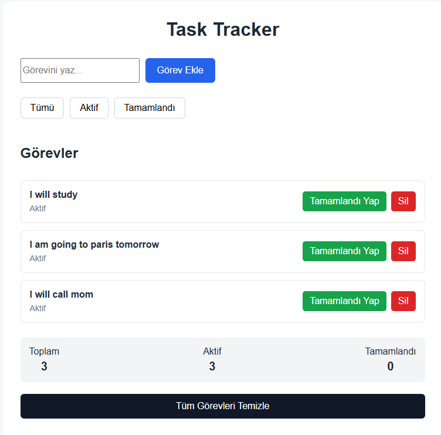
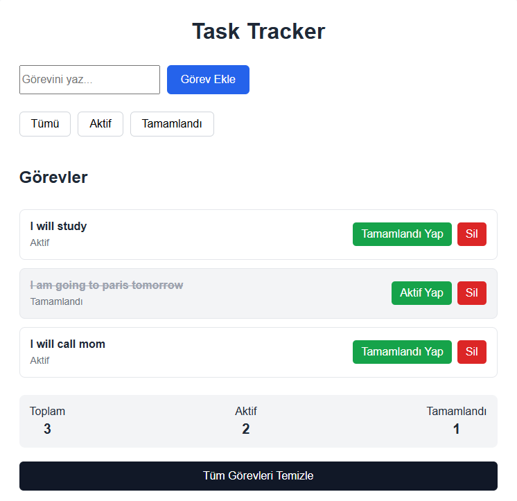
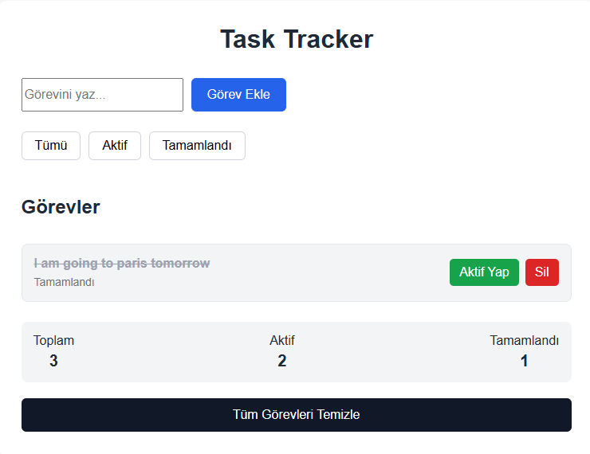

# React Task Tracker

A simple task tracking application built with React.

This project was created to practice the fundamental concepts of React such as components, props, state management, event handling, conditional rendering, filtering, and dynamic lists.

## Features

- Add new tasks
- Delete tasks
- Mark tasks as completed or active
- Filter tasks by:
  - All
  - Active
  - Completed
- Display task statistics
- Clear all tasks
- Prevent empty tasks from being added

## Screenshots

### Task List



### Completed Task



### Completed Tasks Filter



## Technologies

- React
- JavaScript
- Vite
- HTML
- CSS

## React Concepts Practiced

- Components
- Props
- useState
- Event Handling
- Conditional Rendering
- Array `map()`
- Array `filter()`
- `key`
- Controlled Inputs
- Passing functions through props
- State-based filtering

## Project Structure

```text
src/
├── components/
│   ├── TaskForm.jsx
│   ├── TaskList.jsx
│   ├── TaskItem.jsx
│   ├── TaskFilter.jsx
│   └── TaskStats.jsx
├── App.jsx
├── App.css
├── index.css
└── main.jsx